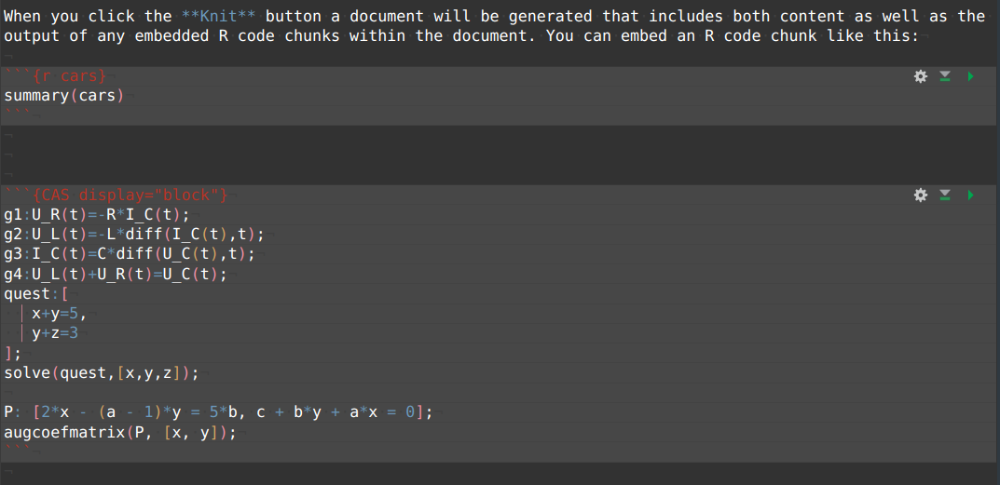
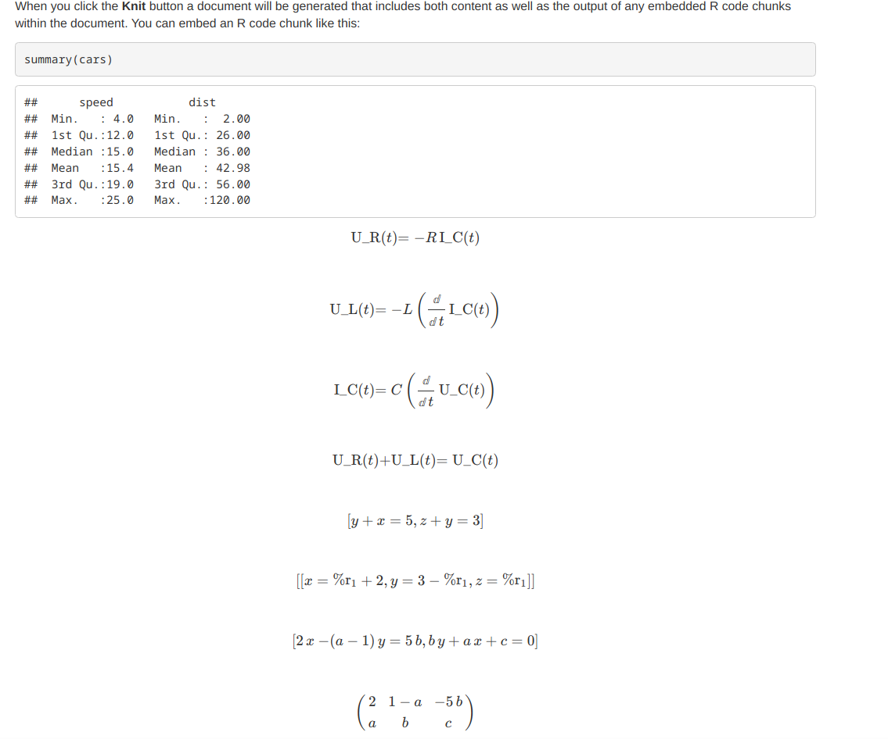
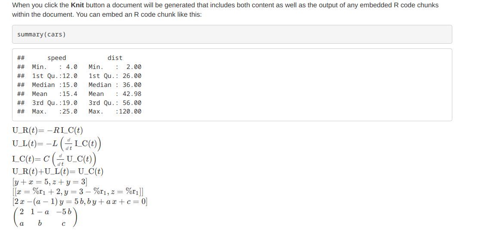
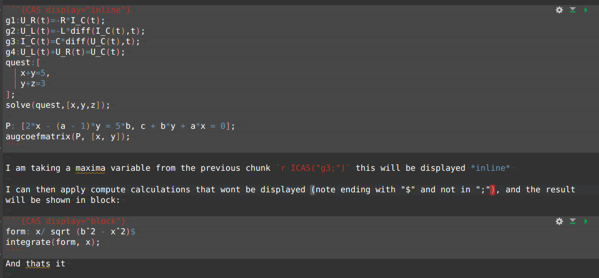
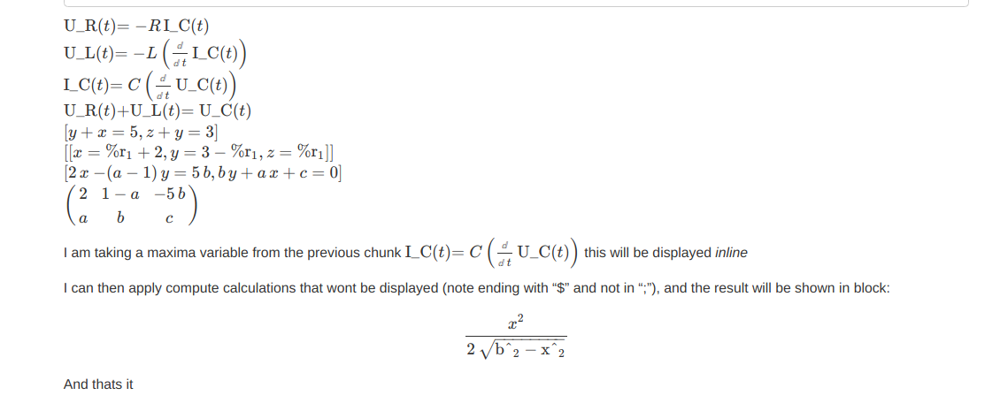

# BitterCAS

I have missed some CAS features in R, so i have added a very very thin interface to access maxima capabilities to nicely display formulas in mathml format.

Using this library should be very easy, although it is not yet ready to be used by other than me. I will be updating it when i find it lacking in the things I need but I will willing to add changes proposed by others if those changes do not break the normal workflow. (Obviously if the normal workflow is wrong i will change it without caring too much if that breaks older code).

This interface is initially only thought to be used from RMarkdown documents, but it is not hard to implement in the normal R scripts.

## Use:

From a RMarkdown file, initialize the project and indicate the file location, temporary files will be saved in the same file location but within a tmp subdirectory:

Then, you can simply run r and maxima code:

Note that **display** is set to **block**, so formulas will be displayed for exposition.

One must then knit to HTML the document, this will be rendered as follows:

Change the display to **inline** to make the formulas inline:

You can also write formulas in between text and take calculations used on previous chunks:

 Being this displayed as follows:

well, that is it for now.

known issues:

-   no control on ports assigned

-   I have not explored adding plots.

-   maxima port will close if not used for a long time, if this happen just reload the library.

-   ??
